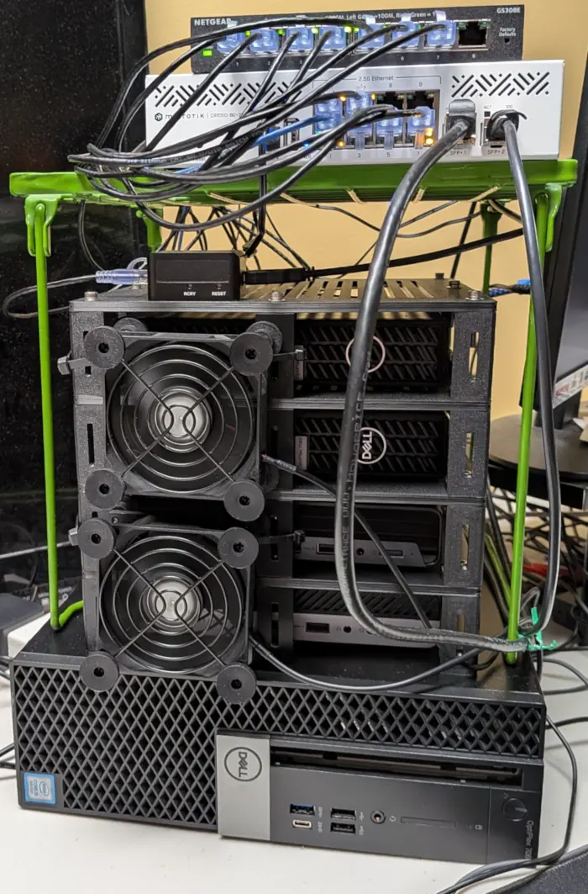

 
 # Homelab

 

  

 
 This repository contains configuration, documentation, and automation for managing my homelab.
 
 ## Structure
 
 - **docs/**: Documentation, architecture decisions, and host-specific setup guides.
 - **infrastructure/**: Infrastructure-as-code (Ansible, Packer, Tofu), networking configs, and automation scripts.
 - **services/**: Service-specific configurations
 
 ## Getting Started
 
 1. Review the documentation in `docs/` for architecture and setup guides.
 2. Infrastructure automation is managed via Ansible in `infrastructure/ansible/`.
 3. Service configurations are organized under `services/` by service name.
 
&nbsp;

**466f724a616e6574**