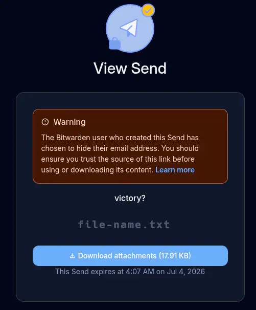
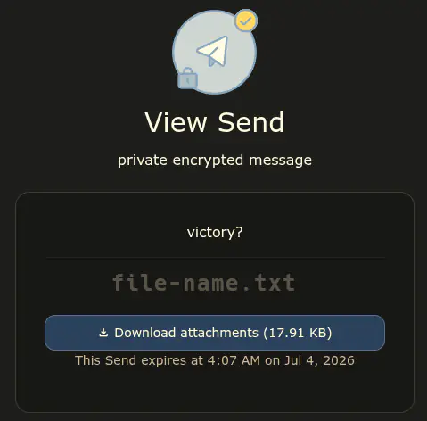

# fix vaultwarden send warning message

If the box is checked to `[ ] hide my email address from recipients`

Anyone using the link is greeted by a message at the top of the send box saying:

```text
! Warning
The Bitwarden user who created this Send has
chosen to hide their email address. You should
ensure you trust the source of this link before
using or downloading its contents. Learn more
```

See picture below:



Which would be fine, but if you don't check the `[ ] hide my email address from recipients` box. There is no warning message at all.

Manipulting the sender field is not difficult, you should never inherently trust a thing you're sent, and always `ensure you trust the source of this link before using or downloading it's contents`.

The message is fundamentally flawed, and not helpful.

## remove warning message and replace it with user defined string

The [patch-send-main.sh](./patch-send-main.sh) script is my solution. There will no longer be a warning message or a message about the Bitwarden user that sent the message. That is replaced with a user defined string.

What the new version looks like:



(ignore the color differences, those only occur in incognito vs non-incognito windows during testing)

(also, the pictures are highly compressed .webp, so if they look off it's not a result of true rendering looking off, it just seems odd to post large amounts of picture data to a repo)

### implementation

**What it does:**
1. Forces `hideEmail=true` when saving Sends
2. Sets `hideEmail()` to always false (no warning banner)
3. Replaces the i18n subtitle with exact custom text

**Usage:**

- The **JavaScript** file that matters is always in the container at `/web-vault/app/main.<hash>.js`.

```sh
# 1. Pull main.js out of the container
# "docker|podman" can be substituted for "nerdctl" below depending upon container environment
nerdctl cp vaultwarden:/web-vault/app/main.XXXXXXXX.js ./main.XXXXXXXX.js

# 2. Patch it (first run saves main.XXXXXXXX.js.orig automatically)
VAULTWARDEN_SEND_SUBTITLE='Your full custom message here.' ./patch-send-main.sh main.XXXXXXXX.js

# 3. Copy back
# "docker|podman" can be substituted for "nerdctl" below depending upon container environment
nerdctl cp ./main.XXXXXXXX.js vaultwarden:/web-vault/app/main.XXXXXXXX.js
```

Re-run with a new message anytime. It always patches from the `.orig` backup, so wording can be updated without re-extracting from the container.

**Notes:**
- Env var: `VAULTWARDEN_SEND_SUBTITLE` (required)
- Optional arg: path to `main.<hash>.js`; otherwise looks for `./main.*.js` or `./app/main.*.js`
- Quotes and `&` in your message are handled
- Hard-refresh the browser after deploying; verify with `curl` if needed
- If the script errors with "anchor not found", the bundle layout changed on a Vaultwarden upgrade and anchors need updating

&nbsp;

**466f724a616e6574**